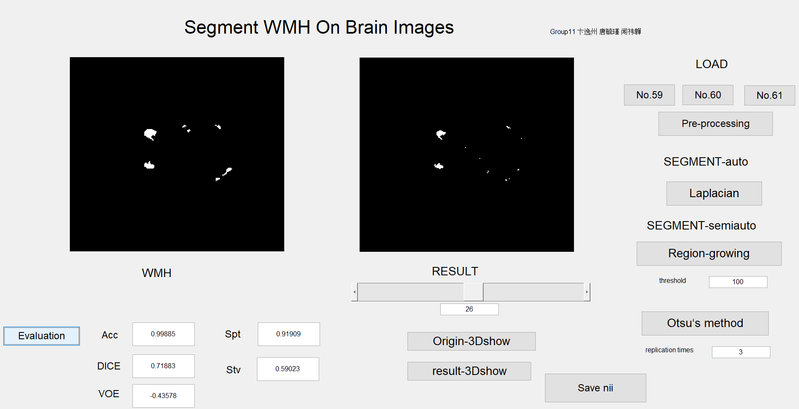

# BMH-segmentation
This repository is for the group project of **Biomedical Image Process**.

White Matter Hyperintensities Segmentation in MRI Image

## Group11.m

 This is the all the codes with a GUI.

## Otsu

Otsu’s method is comparatively a conservative approach. It can always get valid results. However, its time cost is the largest.

## Spatial filters

Spatial filters seem to be not so effective in the hyperintensity segmentation, but it does give an interesting result where further researches can be done. Morphological procedures and different threshold algorithms might be useful.

## Region growing 

Region growing method focus on main region and thus lose some important small information. But it could have a really good effect in images from 21 to 33. This method also provides a different angle to think about WMH’s essential characteristic.
